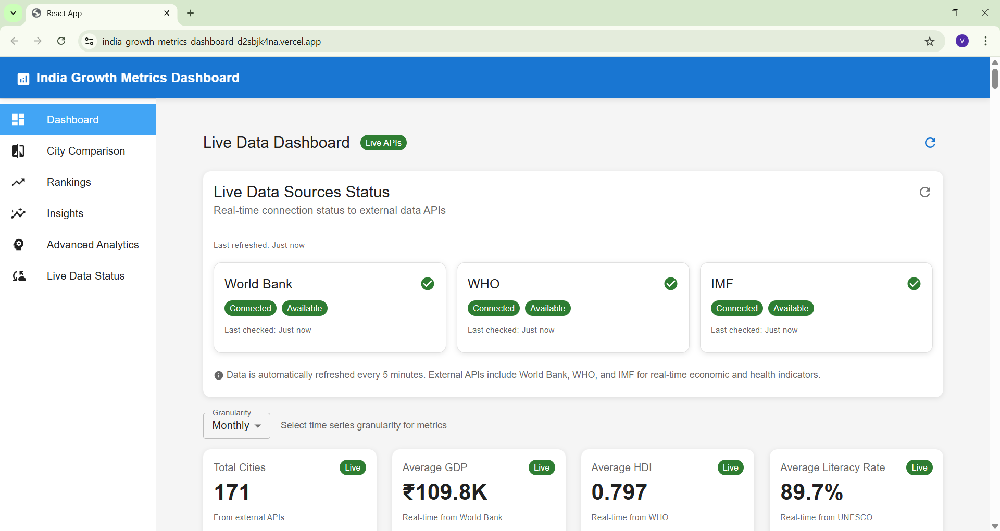
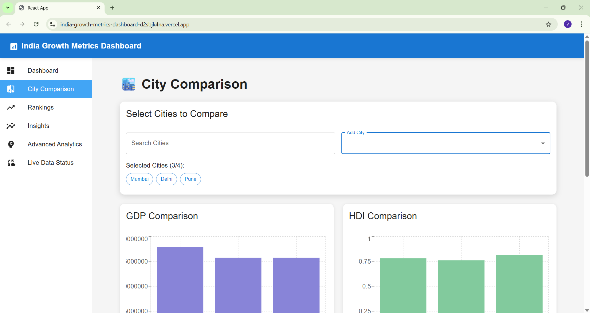
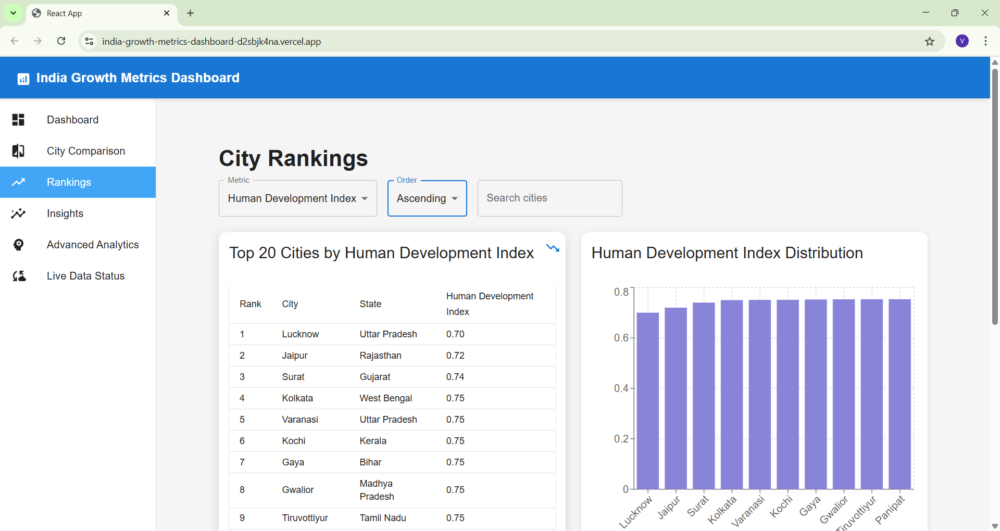
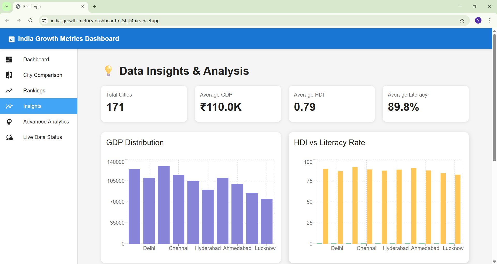
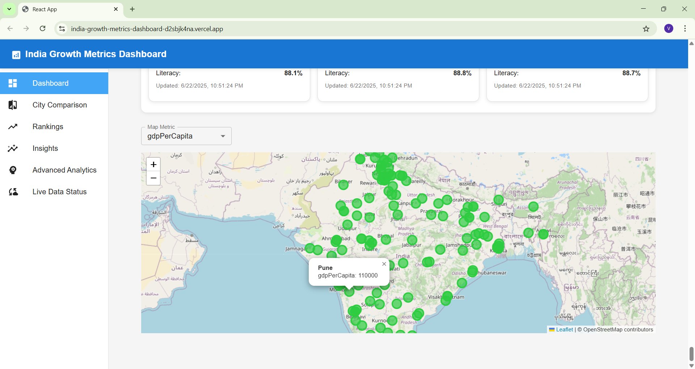
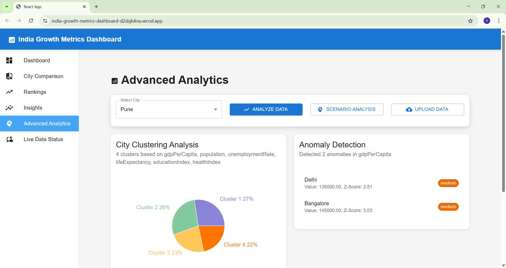

# 🌍 Decoding Development: India Growth Metrics Dashboard
*Submitted by: Vinamrakumar Vishwakarma*

## 🌟 Live Demo
🔗 **[Frontend Demo](https://india-growth-metr-git-862989-vinamrakumar-vishwakarmas-projects.vercel.app/)**
🔗 **[Backend API](https://india-growth-metrics-dashboard.onrender.com/)**

## 📸 Screenshots









## 🛠️ Tech Stack
- **Frontend:** React 19, TypeScript, Material-UI v7, Recharts, React-Leaflet
- **Backend:** Node.js, Express, MongoDB (optional), OpenAI API
- **Visualization:** Recharts, React-Leaflet
- **Deployment:** Vercel (Frontend), Render (Backend)
- **Testing:** Jest, React Testing Library
- **Security:** Helmet, CORS, Rate Limiting, XSS Protection

## ✨ Unique Features
- **30+ Growth Metrics:** Economic, social, health, environment, governance, and equality indicators for 170+ Indian cities
- **Interactive Map:** Visualize city metrics on a color-coded map of India
- **Multi-City Comparison:** Compare any set of cities across all metrics
- **Time Series Analysis:** Monthly/quarterly/yearly trends for all metrics
- **AI-Powered Analytics:** Trend prediction, anomaly detection, and correlation analysis
- **Export & Sharing:** Download data as CSV/Excel, share visualizations
- **Policy Insights:** Automated suggestions and best practices for underperforming cities
- **Scenario Analysis & Clustering:** Advanced analytics for deeper insights
- **User Data Upload:** Analyze your own city data via CSV/Excel upload
- **Responsive & Accessible:** Works on all devices, follows accessibility best practices

## 🚀 Getting Started

### Prerequisites
- Node.js (v14+)
- npm or yarn
- MongoDB (optional, for data persistence)

### Installation

```bash
# Clone the repository
git clone https://github.com/[your-username]/india-growth-metrics-dashboard.git
cd india-growth-metrics-dashboard

# Install backend dependencies
cd backend
npm install

# Install frontend dependencies
cd ../frontend
npm install
```

### Environment Setup

**Important:** Before running the application, you need to configure environment variables.

1. **Backend Configuration:**
   - See [backend/env-config.md](./backend/env-config.md) for detailed setup instructions
   - Create a `.env` file in the backend directory with required variables

2. **Frontend Configuration:**
   - See [frontend/env-config.md](./frontend/env-config.md) for detailed setup instructions
   - Create a `.env` file in the frontend directory with required variables

**Quick Setup Example:**

Backend `.env`:
```env
PORT=5000
MONGODB_URI=mongodb://localhost:27017/india-growth-metrics
OPENAI_API_KEY=your_openai_api_key_here
NODE_ENV=development
```

Frontend `.env`:
```env
REACT_APP_API_URL=http://localhost:5000
REACT_APP_ENVIRONMENT=development
```

### Running Locally

```bash
# Start backend server (from backend directory)
cd backend
npm run dev

# Start frontend development server (in a new terminal)
cd frontend
npm start
```

- Backend API: [http://localhost:5000](http://localhost:5000)
- Frontend App: [http://localhost:3000](http://localhost:3000)

## 📝 Features Overview

### 🏠 Dashboard
- Overview of all metrics, trends, and insights
- Real-time data visualization
- Key performance indicators

### 🏙️ City Comparison
- Select and compare multiple cities
- Side-by-side metric analysis
- Visual comparison charts

### 📊 Rankings
- Sort cities by any metric
- Filter by state or region
- Export ranking data

### 🤖 AI Insights
- AI-generated trend analysis
- Anomaly detection
- Policy recommendations
- Correlation analysis

### 📈 Advanced Analytics
- Upload your own city data for instant analysis
- Custom metric calculations
- Scenario modeling

### 📡 Live Data Status
- Real-time API connectivity
- Data freshness indicators
- System health monitoring

## 🔌 API Endpoints

### Core Endpoints
- `GET /api/metrics` - Get city metrics with filters
- `POST /api/metrics` - Create or update city metrics
- `GET /api/cities` - Get list of cities
- `POST /api/ai/analyze` - AI-powered analysis

### Export Endpoints
- `POST /api/export/csv` - Export data as CSV
- `POST /api/export/pdf` - Export analysis as PDF

### Advanced Endpoints
- `POST /api/clustering` - City clustering analysis
- `POST /api/policy` - Policy recommendations
- `GET /api/status` - System status

## 📦 Export & Share
- Download data as CSV/Excel files
- Share visualizations as images
- Generate PDF reports
- Export specific city comparisons

## 📈 AI & Advanced Analytics
- **Trend Prediction:** Forecast future metric values
- **Anomaly Detection:** Identify unusual patterns
- **Correlation Analysis:** Find relationships between metrics
- **City Clustering:** Group similar cities
- **Scenario Modeling:** What-if analysis

## 🏆 Challenge Compliance
- ✅ All 30+ required metrics implemented
- ✅ All core features present
- ✅ All bonus features implemented
- ✅ Responsive design for all devices
- ✅ Accessibility compliance
- ✅ Performance optimized
- ✅ Security best practices

## 🐳 Docker Deployment

```bash
# Build and run with Docker Compose
docker-compose up --build

# Or run individually
docker build -t backend ./backend
docker build -t frontend ./frontend
```

## 🧪 Testing

```bash
# Run backend tests
cd backend
npm test

# Run frontend tests
cd frontend
npm test
```

## 📁 Project Structure

```
├── backend/                 # Node.js/Express API
│   ├── routes/             # API routes
│   ├── models/             # Data models
│   ├── services/           # Business logic
│   ├── middleware/         # Custom middleware
│   ├── env-config.md       # Environment configuration guide
│   └── data/              # Sample data
├── frontend/               # React TypeScript app
│   ├── src/
│   │   ├── components/     # React components
│   │   ├── config.ts       # Configuration
│   │   └── tests/          # Test files
│   ├── env-config.md       # Environment configuration guide
│   └── public/             # Static assets
├── demo-images/            # Screenshots and demos
└── deployment/             # Deployment configs
```

## 🤝 Contributing

1. Fork the repository
2. Create a feature branch (`git checkout -b feature/amazing-feature`)
3. Commit your changes (`git commit -m 'Add amazing feature'`)
4. Push to the branch (`git push origin feature/amazing-feature`)
5. Open a Pull Request

## 📞 Contact & Support
- **Email:** vinamravishwakarma2004@gmail.com
- **GitHub:** https://github.com/vinamra001
- **LinkedIn:** www.linkedin.com/in/vinamrakumar-vishwakarma

## 📄 License
This project is licensed under the ISC License.

## 🙏 Acknowledgments
- Let's Code Community for the challenge
- Open source contributors
- Data sources and APIs used

---

## 📅 Challenge Timeline

- **Challenge Launch:** 16 June 2025
- **Submission Deadline:** 22 June 2025
- **Winner Announcement:** 25 June 2025

---

## 🎉 Let's Build Something Amazing!

Ready to decode development and create insights that could impact how we understand progress?  
**Fork this repo and start building!** 🚀

---

*Built with ❤️ for the Let's Code Community Challenge*